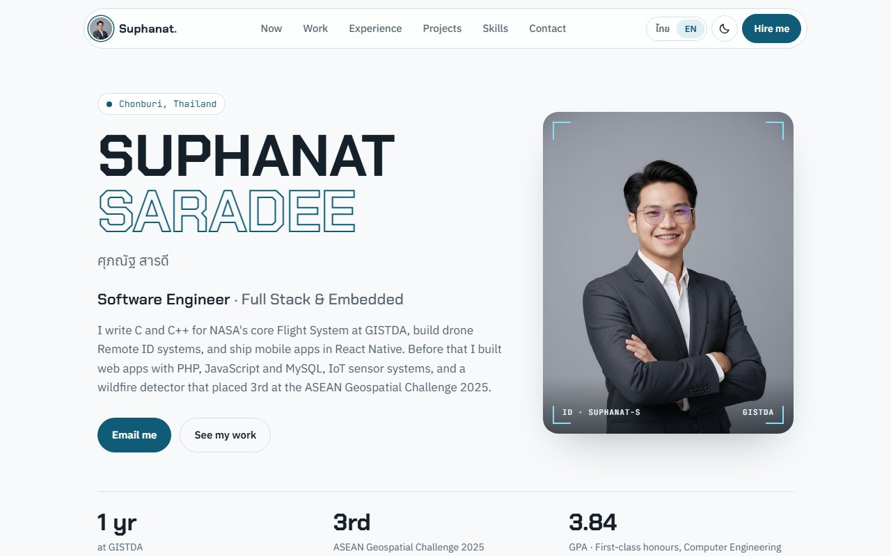

# Portfolio

Personal portfolio of Suphanat Saradee, software engineer at GISTDA.

**Live site:** https://suphanat91.github.io/portfolio/



## Features

- English and Thai, switchable from the top bar. The choice is remembered, and visitors whose browser is set to Thai see Thai first.
- Light and dark themes.
- Work gallery with category tabs, justified photo rows and a full-screen viewer (arrow keys, swipe, thumbnails).
- Animated Remote ID radar drawn on a canvas, with simulated drone contacts.
- Sections fade in on scroll; all motion is turned off for visitors who prefer reduced motion.
- Deployed to GitHub Pages by GitHub Actions on every push to `main`.

Built with Angular 22: standalone components, signals and the built-in control flow. No UI library.

## Run locally

```bash
npm install
npm start          # http://localhost:4200
```

## Editing content

- `src/app/data/profile.ts`: intro, experience, projects and skills.
- `src/app/data/gallery.ts`: Work gallery images, titles and captions.
- `src/app/i18n.ts`: interface text (navigation, buttons, section copy) and the language service.

Every piece of text has an `en` and a `th` value.

## Adding work images

1. Put two copies of the image in `public/work/<category>/`: `name.jpg` (about 1600 px on the long edge) for the viewer and `name-sm.jpg` (about 720 px) for the grid. Strip EXIF data first, since phone photos often include GPS coordinates.
2. Add an entry to `src/app/data/gallery.ts` with the file name, category, title, caption and the full-size width and height.

Categories: `product`, `field`, `talks`, `schematic`. Tabs only appear for categories that have images.

## Structure

- `src/app/app.*`: page layout, top bar, hero, theme and language switches.
- `src/app/projects/`: project grid with tag filtering (`signal` + `computed`).
- `src/app/gallery/`: Work gallery and full-screen viewer (`<dialog>`).
- `src/app/radar/`: animated Remote ID radar.
- `src/app/reveal.ts`: directive that fades elements in on scroll.
- `src/styles.css`: color and font tokens for both themes.

## Deploy

Pushing to `main` runs `.github/workflows/deploy.yml`, which builds the site with `npm run build:gh-pages` (base href `/portfolio/`) and publishes `dist/portfolio/browser` to GitHub Pages. Progress is visible under the repository's **Actions** tab.
